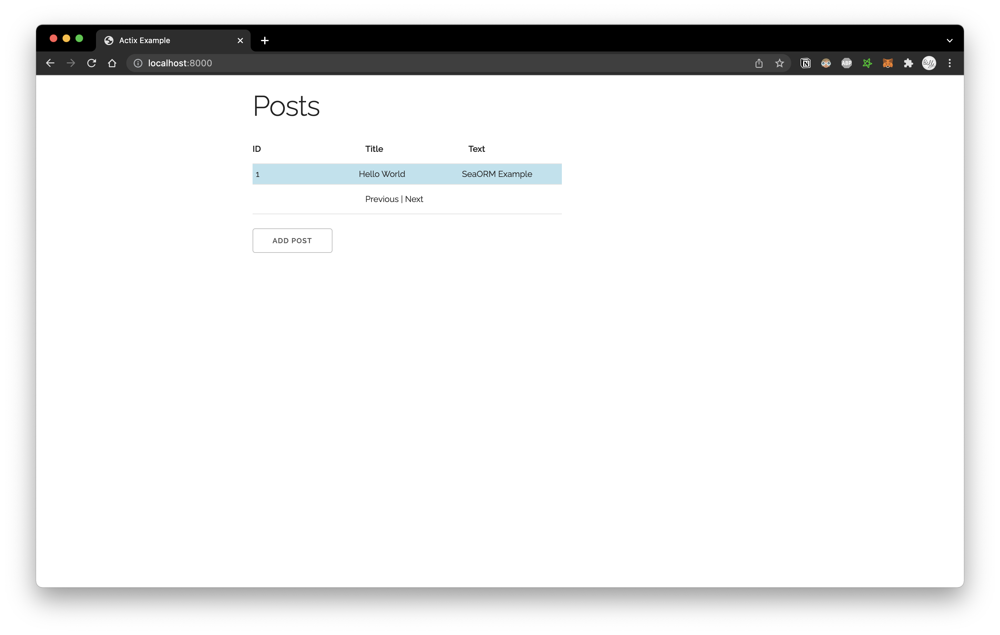

# Actix 4 with SeaORM example app

1. Modify the `DATABASE_URL` var in `.env` to point to your chosen database

1. Turn on the appropriate database feature for your chosen db in `entity/Cargo.toml` (the `"sqlx-mysql",` line)

1. Execute `cargo run` to start the server

1. Visit [localhost:8000](http://localhost:8000) in browser

Run server with auto-reloading:

```bash
cargo install systemfd
systemfd --no-pid -s http::8000 -- cargo watch -x run
```
