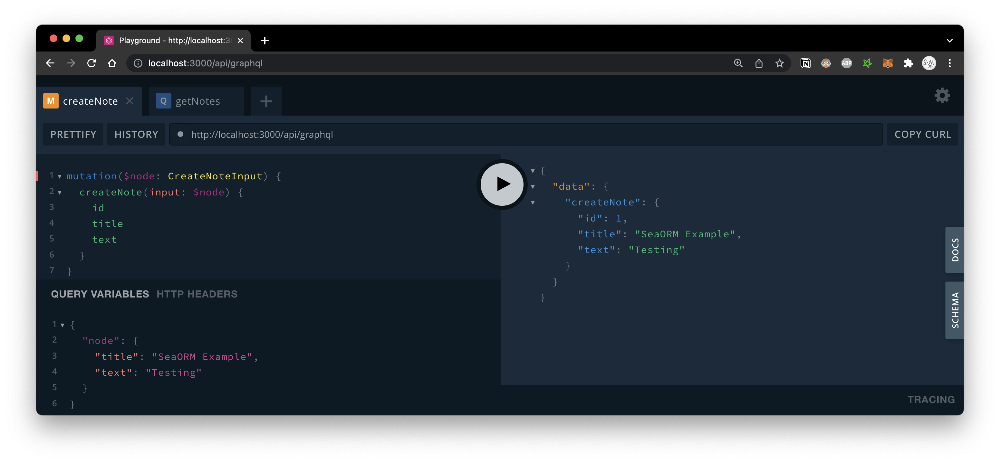
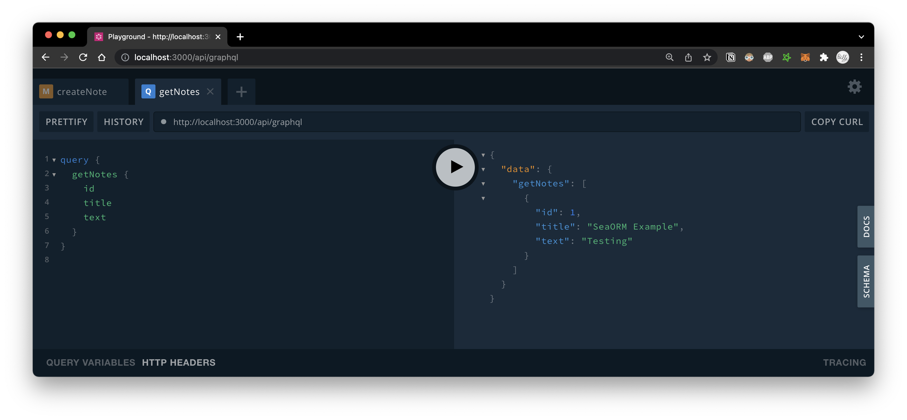

# Axum-GraphQL with SeaORM example app

1. Modify the `DATABASE_URL` var in `.env` to point to your chosen database

1. Turn on the appropriate database feature for your chosen db in `core/Cargo.toml` (the `"sqlx-sqlite",` line)

1. Execute `cargo run` to start the server

1. Visit [localhost:3000/api/graphql](http://localhost:3000/api/graphql) in browser

Run mock test on the core logic crate:

```bash
cd core
cargo test --features mock
```
