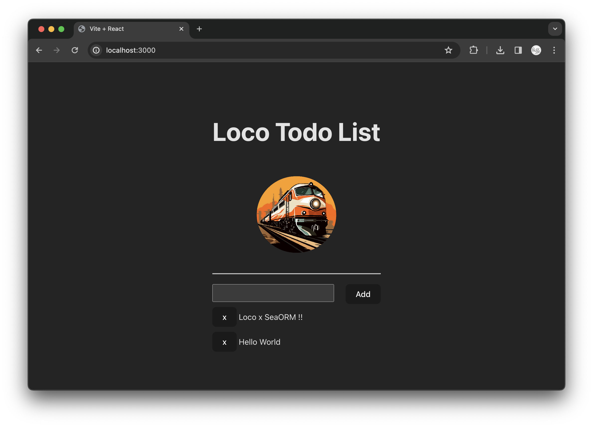

> Adapted from https://github.com/loco-rs/todo-list

# Loco with SeaORM example todo list

Build your own todo list website using Loco. Follow the step-by-step guide [here](<(https://loco.rs/blog/frontend-website/)>) to create it effortlessly.

## Build Client

Navigate to the `frontend` directory and build the client:

```sh
$ cd frontend && yarn install && yarn build

vite v5.0.8 building for production...
✓ 120 modules transformed.
dist/index.html                   0.46 kB │ gzip:  0.30 kB
dist/assets/index-AbTMZIjW.css    1.26 kB │ gzip:  0.65 kB
dist/assets/index-MJFpQvzE.js   235.64 kB │ gzip: 75.58 kB
✓ built in 2.01s
```

## Run Locally

You need:

* A local postgres instance

Check out your development [configuration](config/development.yaml).

> To configure a database , please run a local postgres database with <code>loco:loco</code> and a db named <code>[app name]_development.</code>: 
<code>docker run -d -p 5432:5432 -e POSTGRES_USER=loco -e POSTGRES_DB=[app name]_development -e POSTGRES_PASSWORD="loco" postgres:15.3-alpine</code>

Execute the following command to run your todo list website locally, serving static assets from `frontend/dist`:

```sh
$ cargo loco start

    Finished dev [unoptimized + debuginfo] target(s) in 0.53s
     Running `target/debug/todolist-cli start`
2024-02-01T08:49:41.070430Z  INFO loco_rs::db: auto migrating
2024-02-01T08:49:41.073698Z  INFO sea_orm_migration::migrator: Applying all pending migrations
2024-02-01T08:49:41.078191Z  INFO sea_orm_migration::migrator: No pending migrations
2024-02-01T08:49:41.100557Z  INFO loco_rs::controller::app_routes: [GET] /api/_ping
2024-02-01T08:49:41.100617Z  INFO loco_rs::controller::app_routes: [GET] /api/_health
2024-02-01T08:49:41.100667Z  INFO loco_rs::controller::app_routes: [GET] /api/notes
2024-02-01T08:49:41.100702Z  INFO loco_rs::controller::app_routes: [POST] /api/notes
2024-02-01T08:49:41.100738Z  INFO loco_rs::controller::app_routes: [GET] /api/notes/:id
2024-02-01T08:49:41.100791Z  INFO loco_rs::controller::app_routes: [DELETE] /api/notes/:id
2024-02-01T08:49:41.100817Z  INFO loco_rs::controller::app_routes: [POST] /api/notes/:id
2024-02-01T08:49:41.100934Z  INFO loco_rs::controller::app_routes: [Middleware] Adding limit payload data="5mb"
2024-02-01T08:49:41.101017Z  INFO loco_rs::controller::app_routes: [Middleware] Adding log trace id
2024-02-01T08:49:41.101057Z  INFO loco_rs::controller::app_routes: [Middleware] Adding timeout layer
2024-02-01T08:49:41.101192Z  INFO loco_rs::controller::app_routes: [Middleware] Adding cors
2024-02-01T08:49:41.101241Z  INFO loco_rs::controller::app_routes: [Middleware] Adding static

                      ▄     ▀
                                 ▀  ▄
                  ▄       ▀     ▄  ▄ ▄▀
                                    ▄ ▀▄▄
                        ▄     ▀    ▀  ▀▄▀█▄
                                          ▀█▄
▄▄▄▄▄▄▄  ▄▄▄▄▄▄▄▄▄   ▄▄▄▄▄▄▄▄▄▄▄ ▄▄▄▄▄▄▄▄▄ ▀▀█
 ██████  █████   ███ █████   ███ █████   ███ ▀█
 ██████  █████   ███ █████   ▀▀▀ █████   ███ ▄█▄
 ██████  █████   ███ █████       █████   ███ ████▄
 ██████  █████   ███ █████   ▄▄▄ █████   ███ █████
 ██████  █████   ███  ████   ███ █████   ███ ████▀
   ▀▀▀██▄ ▀▀▀▀▀▀▀▀▀▀  ▀▀▀▀▀▀▀▀▀▀  ▀▀▀▀▀▀▀▀▀▀ ██▀
       ▀▀▀▀▀▀▀▀▀▀▀▀▀▀▀▀▀▀▀▀▀▀▀▀▀▀▀▀▀▀▀▀▀▀▀▀▀▀▀
                https://loco.rs

environment: development
   database: automigrate
     logger: debug
compilation: debug
      modes: server

listening on port 3000
```

## Development

To develop the UI, run the following commands:

```sh
$ cd frontend && yarn install && yarn dev
```

To run the server:

```sh
$ cargo loco start
```
