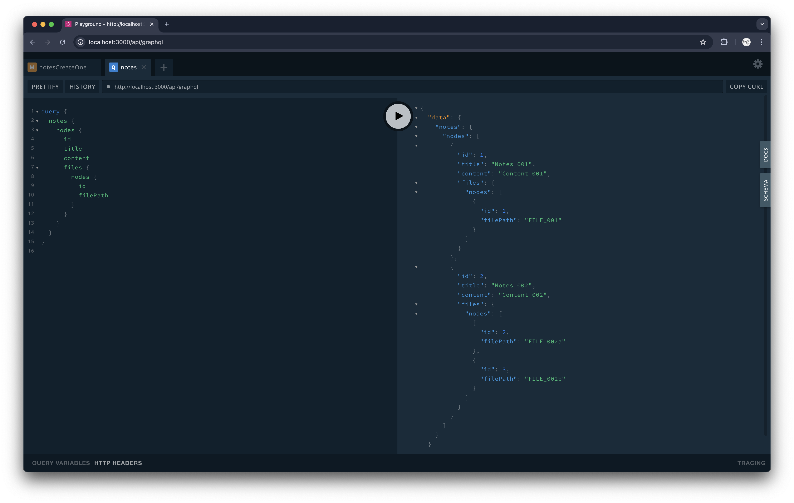
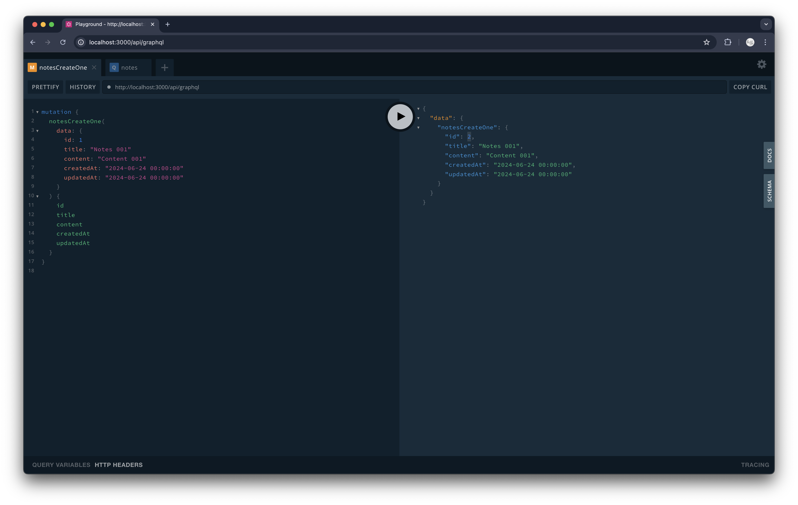

# Adding GraphQL Support to Loco with Seaography

In this tutorial, we would add a GraphQL endpoint with [Seaography](https://github.com/SeaQL/seaography) based on our Loco starter application.

Read The full tutorial [here](https://www.sea-ql.org/blog/2024-07-01-graphql-support-with-loco-seaography/).

Read our first tutorial of the series, [Getting Started with Loco & SeaORM](https://www.sea-ql.org/blog/2024-05-28-getting-started-with-loco-seaorm/), if you haven't.

