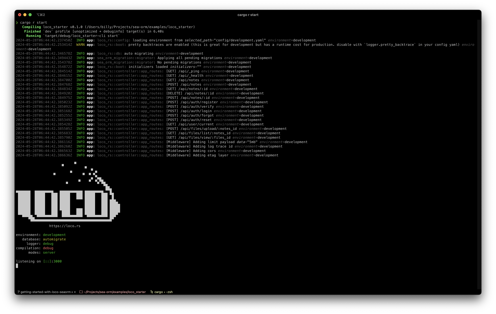
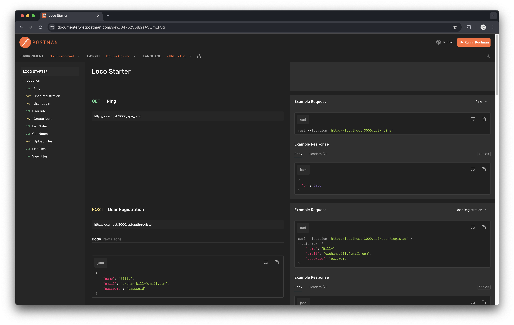

# Getting Started with Loco & SeaORM

This is an REST notepad backend based on the Loco starter template, with addition of a new REST endpoint to handle file uploads.

Read The full tutorial [here](https://www.sea-ql.org/blog/2024-05-28-getting-started-with-loco-seaorm/). The documentation of the REST API is available [here](https://documenter.getpostman.com/view/34752358/2sA3QmEF5q).

