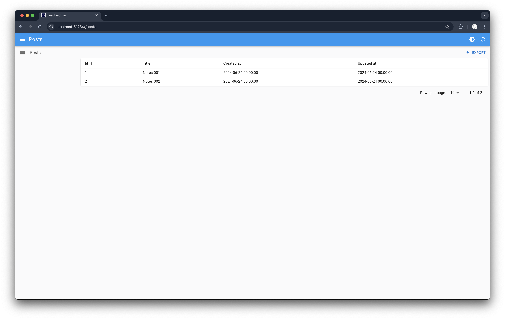
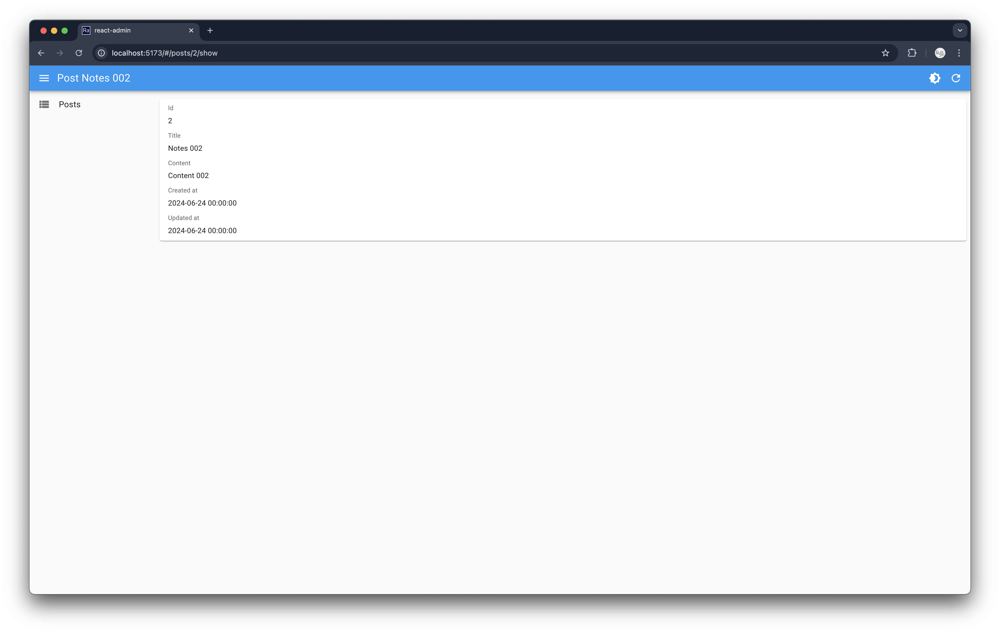

# GraphQL based Admin Dashboard with Loco and Seaography

In this tutorial, we would develop a GraphQL based admin dashboard with [Seaography](https://github.com/SeaQL/seaography) and Loco.

Read The full tutorial [here](https://www.sea-ql.org/blog/2024-08-08-graphql-admin-dashboard-with-loco-seaography/).

Read our first and second tutorial of the series, [Getting Started with Loco & SeaORM](https://www.sea-ql.org/blog/2024-05-28-getting-started-with-loco-seaorm/), [Adding GraphQL Support to Loco with Seaography](https://www.sea-ql.org/blog/2024-07-01-graphql-support-with-loco-seaography/), if you haven't.

