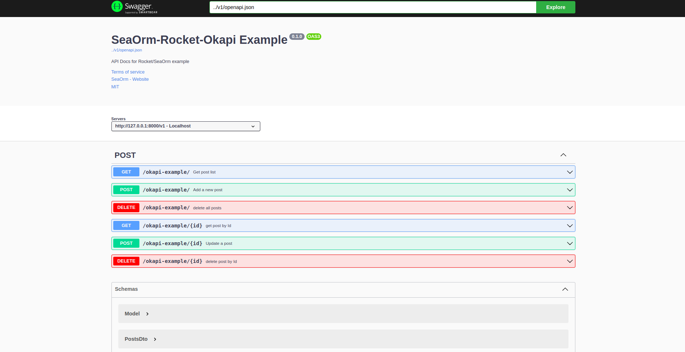

# Rocket with SeaORM example app

1. Modify the `url` var in `api/Rocket.toml` to point to your chosen database

1. Turn on the appropriate database feature for your chosen db in `core/Cargo.toml` (the `"sqlx-postgres",` line)

1. Execute `cargo run` to start the server

1. Visit [localhost:8000](http://localhost:8000) in browser after seeing the `🚀 Rocket has launched from http://localhost:8000` line

Run mock test on the core logic crate:

```bash
cd core
cargo test --features mock
```

# Rocket Okapi example (Api documentation with Okapi library)
1. You can go to ```http://localhost:8000/swagger-ui/index.html``` to see the api documentation about this demo project.
   
2. You can navigate to ```http://localhost:8000/rapidoc/index.html``` to see the rapidoc format for api documentation 
   
