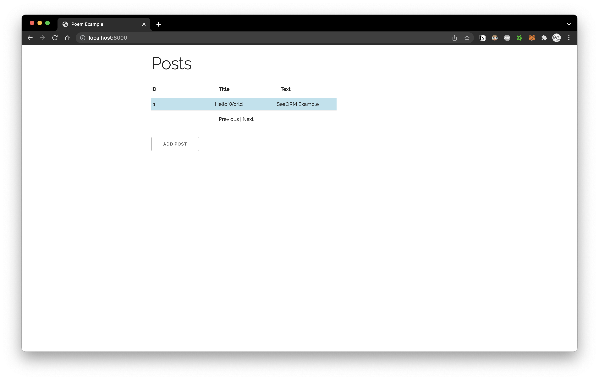

# Poem with SeaORM example app

1. Modify the `DATABASE_URL` var in `.env` to point to your chosen database

1. Turn on the appropriate database feature for your chosen db in `Cargo.toml` (the `"sqlx-sqlite",` line)

1. Execute `cargo run` to start the server

1. Visit [localhost:8000](http://localhost:8000) in browser after seeing the `server started` line
